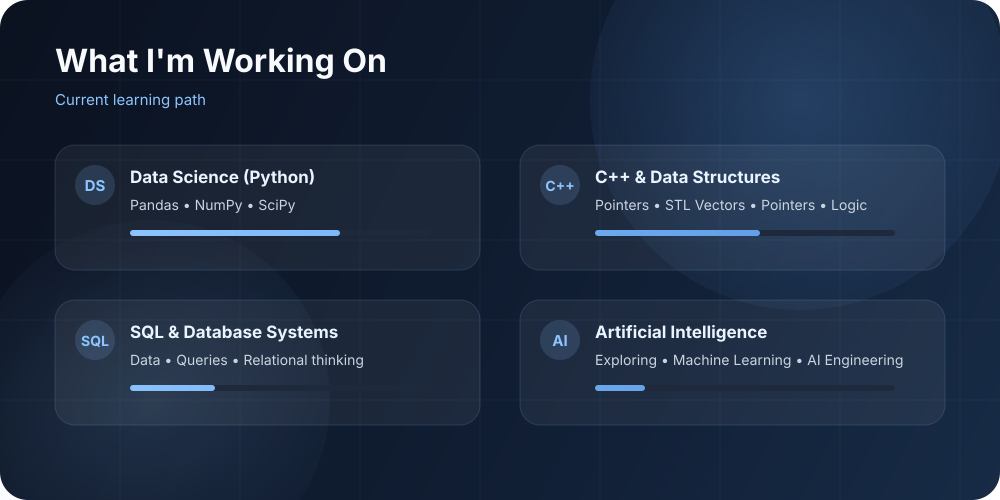
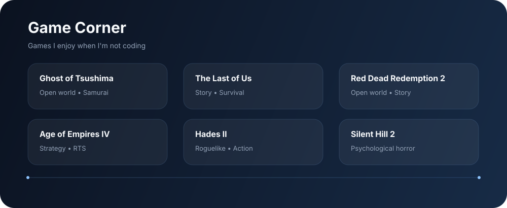

  
    
  
  

 

# Halo, Saya Farrel 👋

### Mahasiswa Teknik Informatika yang senang mempelajari bagaimana berbagai hal bekerja.

Saat ini saya sedang mengeksplorasi **Python, C++, Go, JavaScript, PHP, dan SQL**, sembari mendalami **Data Science, Struktur Data, Database, dan Artificial Intelligence**.

> Terus belajar. Terus berkarya. Terus mencari tahu.

---

## Tentang Saya

Saya adalah seorang **mahasiswa Teknik Informatika** yang tertarik untuk memahami apa yang ada di balik sebuah teknologi.

Perjalanan belajar saya saat ini dimulai dari fundamental dan secara bertahap menuju:

<pre>
Pemrograman
     ↓
C++ & Struktur Data
     ↓
Data Science (Python)
     ↓
SQL & Sistem Basis Data
     ↓
Artificial Intelligence
     ↓
AI Engineering
</pre>

Di luar pemrograman, saya sering mempelajari berbagai bidang lainnya seperti **sejarah, fisika, kimia, ekonomi, hukum, neurosains, fotografi, buku, film, dan game**.

---

## Fokus Saat Ini

  

### Fokus utama

| Proses         | Sedang dieksplorasi                               |
| -------------- | ------------------------------------------------- |
| Mempelajari    | Data Science dengan Python (Pandas · NumPy · SciPy) |
| Mendalami      | C++ & Struktur Data (Pointers · STL · Logika)     |
| Menjelajahi    | SQL & Sistem Basis Data                           |
| Mengamati      | Artificial Intelligence / Machine Learning        |
| Jangka panjang | AI Engineering                                    |

---

## Bahasa Pemrograman

  
  
  
  
  
  

---

## 🧩 Apa yang Sedang Saya Pelajari

### Data Science (Python)
Saat ini sedang mendalami:
* Pandas
* NumPy
* SciPy
* Pembersihan data (Data cleaning)
* Analisis data
* Bekerja dengan dataset
* Fundamental statistik
* Mengubah data mentah menjadi insight

### C++ & Struktur Data
Saat ini sedang membangun fondasi untuk:
* Pointers
* STL Vectors
* Arrays
* Linked lists
* Pemikiran algoritmik
* Control flow
* Searching
* Sorting
* Kompleksitas
* Dekomposisi masalah

### Basis Data (Databases)
Mengeksplorasi:
* SQL
* Basis data relasional
* Tabel
* Relasi
* Queries
* Pemodelan data
* Sistem basis data

### Artificial Intelligence
Arah jangka panjang:

<pre>
Pemrograman
     +
Matematika
     +
Algoritma
     +
Data
     +
Machine Learning
     +
Sistem
     ↓
AI Engineering
</pre>

---

## Aktivitas GitHub

  
    
  

---

## Games

  

---

## 📚 Di Luar Pemrograman

Pemrograman hanyalah salah satu dari sekian banyak hal yang suka saya pelajari. 

| Bidang          | Alasan                                          |
| --------------- | ----------------------------------------------- |
| 🧠 Neurosains   | Memetakan proses belajar, daya ingat, dan kreativitas |
| 📜 Sejarah      | Menelusuri bagaimana sistem dan masyarakat berkembang |
| ⚛️ Fisika       | Membongkar mekanisme di balik realitas            |
| 🧪 Kimia        | Mempelajari materi dan perubahannya               |
| ⚖️ Hukum        | Menganalisis aturan, sistem, dan institusi          |
| 💰 Ekonomi      | Membedah insentif dan pengambilan keputusan     |
| 📷 Fotografi    | Menguasai komposisi visual                       |
| 🎬 Film         | Mengeksplorasi seni bercerita dan bahasa visual       |
| 📖 Buku         | Menyelami gagasan dan berbagai sudut pandang |

---

## 🌐 Mari Terhubung

  
  

---

 

  <h3>Belajar • Berkarya • Mengeksplorasi</h3>
   
  <em>"Semakin banyak saya belajar, semakin banyak pertanyaan yang saya temukan."</em>
    
  

